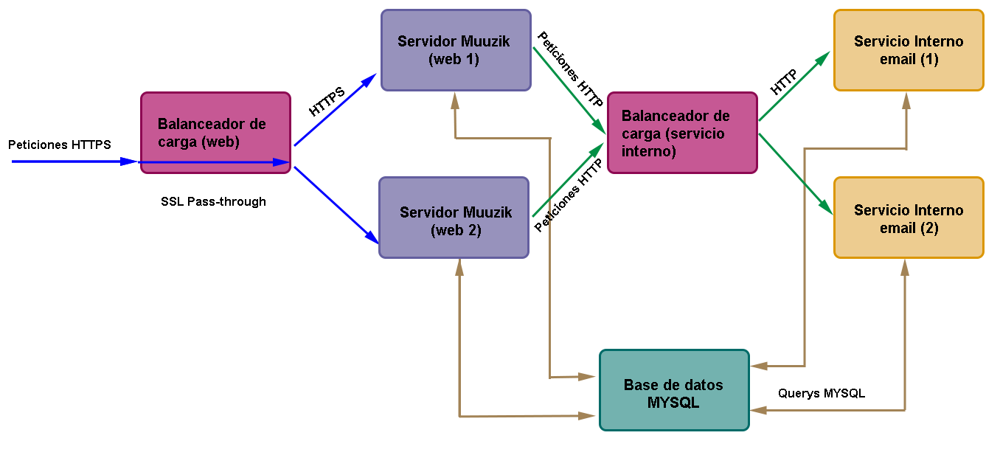
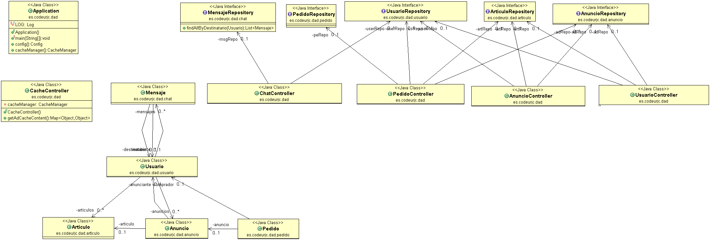
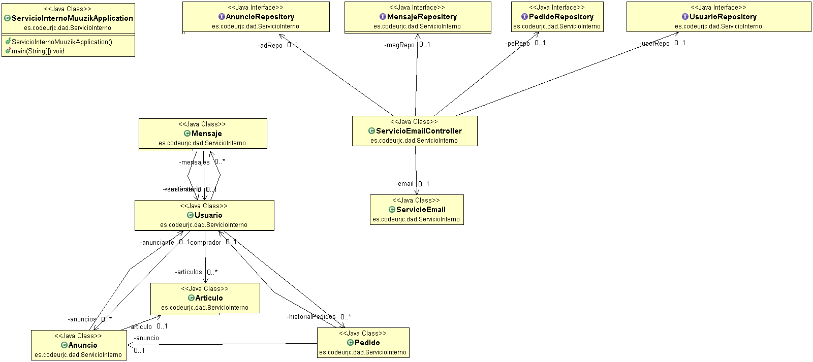
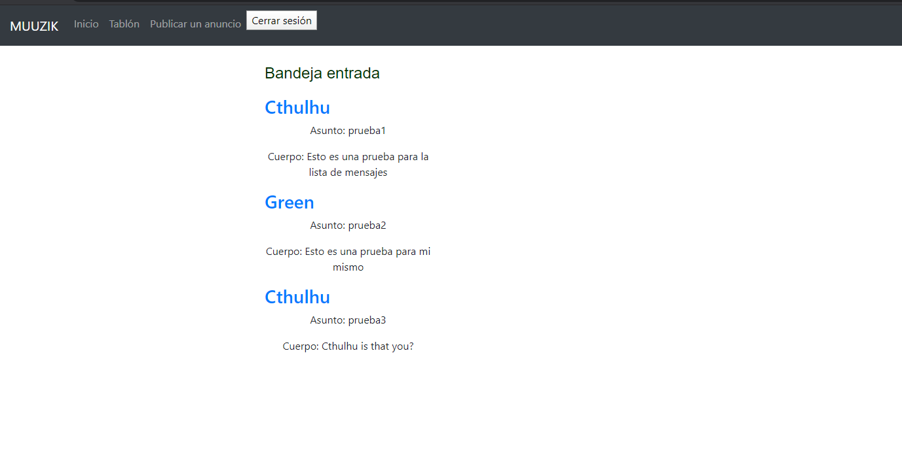

# Muuzik
Compraventa de instrumentos musicales.

## Índice
> - [Descripción](#descripción)
>     - [Funcionalidades](#funcionalidades)
>        - [Funcionalidades públicas](#funcionalidades-públicas)
>         - [Funcionalidades privadas](#funcionalidades-privadas)
>     - [Entidades principales](#entidades-principales)
>     - [Servicio interno](#servicio-interno)
> - [Diagrama UML](#diagrama-uml)  
> - [Modelo Entidad-Relación](#modelo-entidad-relación)
> - [Diagrama de Navegación](#diagrama-de-navegación)  
> - [Despliegue de la máquina virtual](#despliegueVM)
> - [Capturas de pantalla (Fase 3)](#capturas-de-pantalla-de-cada-página-fase-3)
> - [Capturas de pantalla (Fase 2)](#capturas-de-pantalla-en-fase-2)
> - [Equipo de desarrollo](#equipo-de-desarrollo)

## Descripción
Muuzik es una web que ayuda a los músicos a comprar y vender instrumentos y equipo musical de segunda mano entre particulares. Enfocado a la venta de equipo profesional y especializado, pero también para instrumentos de iniciación.

## Vídeo de presentación de la web  
[](https://www.youtube.com/watch?v=V15uJd0LuXs)
https://www.youtube.com/watch?v=V15uJd0LuXs

## Funcionalidades
### Funcionalidades públicas
- Hacer una búsqueda de un cierto artículo por nombre, con posibilidad de filtrado (ciudad del vendedor, precios, fabricante, otras etiquetas).
- Recorrer una lista de artículos publicados que compartan una etiqueta (tipo de música, país de origen del instrumento, ciudad del vendedor).
- Calcular un valor aproximado de un instrumento.

### Funcionalidades privadas
- Hacer una oferta de compra a un anuncio publicado.
- Editar un perfil propio con información como la ciudad, estilos musicales, tipo de perfil (intérprete, luthier, productor musical...).
- Registrar instrumentos y equipo como propios, de manera que se puedan mostrar en el perfil público, o quedar ocultos al resto de usuarios. Especificar si están dispuestos o no a la venta o intercambio.
- Ver el perfil de otros usuarios, sus artículos en venta, los instrumentos que tengan registrados, y las valoraciones emitidas por otros usuarios.
- Enviar un mensaje a un usuario.
- Publicar un anuncio de venta.
- Publicar un anuncio de búsqueda.

## Entidades principales
- **Usuario**: Tiene su alias y contraseña, puede ver sus datos, su lista de instrumentos, su lista de anuncios, mensajes enviados, listas de comprados/artículos vendidos, lista de deseados, y sus valoraciones.
- **Administrador**: Puede eliminar anuncios y mensajes inadecuados o sospechosos, puede suspender cuentas de usuario que se comporten incorrectamente. 
- **Anuncio**: Tipo: Venta / Intercambio / Ambos. Contiene un artículo, usuario vendedor, precio (si es venta). Indica si disponible para envío o no. Precio negociable o no.
- **Artículo**: Clasificación (Instrumento, Accesorio, Equipo eléctrico...), Estado ("Lo vendo/intercambio", "Lo tengo público" o "Lo tengo privado"), Descripción en texto, Fotos o vídeos.
- **Compra**: Asocia un anuncio a su vendedor y su comprador. Los añade a sus listas de vendidos / comprados y les ofrece la posibilidad de dar una valoración.
- **Mensaje**: Texto enviado de un usuario a otro, con un timestamp. Puede estar asociado a un articulo.

## Servicio interno
- **Alertas por correo electrónico:** Recibir correo electrónico cuando uno de tus productos ha sido comprado, o recibes un nuevo mensaje a través de la aplicación.
  ______________________________________________________________________________________________

# Diagrama del despliegue en Docker
Este es el esquema de contenedores Docker y los balanceadores de carga HAProxy empleados.


# Diagrama UML


# Modelo Entidad-Relación
  
  
# Diagrama de Navegación


# Diagrama UML del Servicio Interno


_______________________________________________________________________________________________

# Despliegue de la máquina virtual<a name="despliegueVM"></a>
Hemos creado la máquina virtual de tipo ubuntu/trusty32, utilizando Vagrant a través de línea de comandos. Es necesario configurar la máquina virtual para que se pueda acceder a ella desde el host, a través de la red, por el puerto 8443.
```
cd /vagrant/spring
vagrant up
vagrant ssh
```

### Instalación del JRE de Java 8 (dentro de la VM)
```
sudo add-apt-repository ppa:openjdk-r/ppa
sudo apt-get update
sudo apt-get install openjdk-8-jre
```

### Instalación de MySQL (en la VM)
La contraseña de nuestro usuario root es "1234".
```
sudo apt-get install mysql-server
mysql -u root -p
	mysql> CREATE DATABASE miservidor;
exit
```  
  

### Compilación de la aplicación
Para que se compile y genere el .jar correctamente, es necesario especificar en el pom.xml que queremos que se haga 'repackage' en la build. Después ejecutamos como Maven Build y escribimos "clean package" en el cuadro 'goals'.
```
<build>
	<plugins>
		<plugin>
			<groupId>org.springframework.boot</groupId>
			<artifactId>spring-boot-maven-plugin</artifactId>
	    	<version>2.2.6.RELEASE</version>
		    <executions>
       			<execution>
    				<goals>
        				<goal>repackage</goal>
       				</goals>
       			</execution>
   			</executions>			
   		</plugin>
	</plugins>
</build>
```
### Ejecución
Es necesario guardar los ficheros .jar de la web y del servicio a la carpeta compartida entre el host y la máquina virtual, en nuestro caso es "\vagrant\spring" en el host.

Para poder ejecutar los dos .jar es necesario abrir dos terminales e iniciar la máquina virtual en ambos. Después ejecutaremos un .jar en cada uno.
```
vagrant up
vagrant ssh
cd /vagrant
java -jar ./muuzik.jar
```
```
vagrant up
vagrant ssh
cd /vagrant
java -jar ./ServicioInternoMuuzik.jar
```
___________________________________________________________________________________


# Capturas de pantalla de cada página (Fase 3)

**Inicio**


**Registrar usuario**
<kbd></kbd>

**Usuario guardado**
<kbd></kbd>

**Iniciar sesión**
<kbd></kbd>

**Tablón de anuncios**
<kbd></kbd>
  
**Publicar anuncio**
<kbd></kbd>  
  
**Publicar anuncio**
<kbd></kbd>

**Ver anuncio individual**
<kbd></kbd>  
  
**Ver anuncio como Admin**
<kbd></kbd>

**Perfil usuario**
<kbd></kbd>

**Perfil usuario como Admin**
<kbd></kbd>

**Editar usuario (solo Admin)**
<kbd></kbd>

**Borrar usuario (solo Admin)**
<kbd></kbd>  
  
**Enviar un mensaje a usuario**
<kbd></kbd>  
  
**Bandeja de mensajes**


_____________________________________________________________


# Capturas de pantalla en fase 2

**Inicio**


**Registrar usuario**
<kbd></kbd>

**Usuario guardado**
<kbd></kbd>

**Iniciar sesión**
<kbd></kbd>

**Tablón de anuncios**
<kbd></kbd>

**Ver anuncio individual**
<kbd></kbd>

**Perfil usuario**
<kbd></kbd>

**Editar usuario**
<kbd></kbd>

**Borrar usuario**
<kbd></kbd>

___________________________________________________________________________________


# Equipo de desarrollo
| **Nombre**  | **Correo**  | **Github**  | 
|---|---|---|
| Clara Palomares Calvo  | ce.palomares@alumnos.urjc.es   | https://github.com/Yinith   |  
|  Sergio Arroyo Duque |  s.arroyod.2016@alumnos.urjc.es | https://github.com/SergioArroyoDuque  |
|  Sergio Guisado Durán | s.guisadod@alumnos.urjc.es  |  https://github.com/s-guisadod-green |

# Tablero Trello del desarrollo
https://trello.com/b/WcTbHPPq/muuzik

  [1]: README.md
