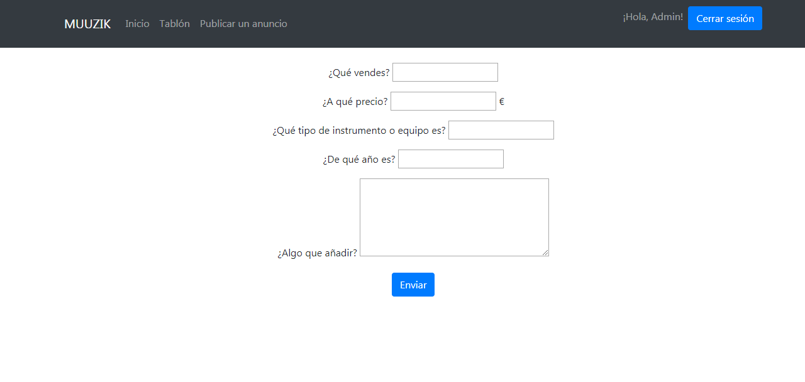

# Muuzik
Compraventa de instrumentos musicales.

## Índice
> - [Descripción](#descripción)
>     - [Funcionalidades](#funcionalidades)
>        - [Funcionalidades públicas](#funcionalidades-públicas)
>         - [Funcionalidades privadas](#funcionalidades-privadas)
>     - [Entidades principales](#entidades-principales)
>     - [Servicio interno](#servicio-interno)
> - [Equipo de desarrollo](#equipo-de-desarrollo)

## Descripción
Muuzik es una web que ayuda a los músicos a comprar y vender instrumentos y equipo musical de segunda mano entre particulares. Enfocado a la venta de equipo profesional y especializado, pero también para instrumentos de iniciación.

## Funcionalidades
### Funcionalidades públicas
- Hacer una búsqueda de un cierto artículo por nombre, con posibilidad de filtrado (ciudad del vendedor, precios, fabricante, otras etiquetas).
- Recorrer una lista de artículos publicados que compartan una etiqueta (tipo de música, país de origen del instrumento, ciudad del vendedor).
- Calcular un valor aproximado de un instrumento.

### Funcionalidades privadas
- Hacer una oferta de compra a un anuncio publicado.
- Editar un perfil propio con información como la ciudad, estilos musicales, tipo de perfil (intérprete, luthier, productor musical...).
- Registrar instrumentos y equipo como propios, de manera que se puedan mostrar en el perfil público, o quedar ocultos al resto de usuarios. Especificar si están dispuestos o no a la venta o intercambio.
- Ver el perfil de otros usuarios, sus artículos en venta, los instrumentos que tengan registrados, y las valoraciones emitidas por otros usuarios.
- Enviar un mensaje a un usuario.
- Publicar un anuncio de venta.
- Publicar un anuncio de búsqueda.

## Entidades principales
- **Usuario**: Tiene su alias y contraseña, puede ver sus datos, su lista de instrumentos, su lista de anuncios, mensajes enviados, listas de comprados/artículos vendidos, lista de deseados, y sus valoraciones.
- **Administrador**: Puede eliminar anuncios y mensajes inadecuados o sospechosos, puede suspender cuentas de usuario que se comporten incorrectamente. 
- **Anuncio**: Tipo: Venta / Intercambio / Ambos. Contiene un artículo, usuario vendedor, precio (si es venta). Indica si disponible para envío o no. Precio negociable o no.
- **Artículo**: Clasificación (Instrumento, Accesorio, Equipo eléctrico...), Estado ("Lo vendo/intercambio", "Lo tengo público" o "Lo tengo privado"), Descripción en texto, Fotos o vídeos.
- **Compra**: Asocia un anuncio a su vendedor y su comprador. Los añade a sus listas de vendidos / comprados y les ofrece la posibilidad de dar una valoración.
- **Mensaje**: Texto enviado de un usuario a otro, con un timestamp. Puede estar asociado a un articulo.

## Servicio interno
- **Anuncios de búsqueda inteligentes:**
Cuando un usuario publica un anuncio del tipo "Interesado en comprar X", la web buscará equipo similar entre toda la gente que haya declarado que posee dicho equipo. Si esta información es pública, se le mostrarán dichos perfiles al usuario interesado, para que pueda hacerles una oferta de compra o de intercambio. Tanto si el dueño lo registró de forma pública como privada, se le notificará a este el nombre del usuario que está buscando ese equipo/instrumento, con un enlace al anuncio, al que podrá contestar si lo desea.

- **Alertas:** Un usuario puede suscribirse para recibir un correo electrónico si se publica un artículo con las características que busca (por ejemplo que contenga ciertas etiquetas).
  
# DiagramaUML

# Modelo Entidad-Relación
  
  
# Diagrama de Navegación en Fase 3

# Capturas de pantalla de cada página (Fase 3)

**Inicio**

**Registrar usuario**
<kbd></kbd>

**Usuario guardado**
<kbd></kbd>

**Iniciar sesión**
<kbd></kbd>

**Tablón de anuncios**
<kbd></kbd>
  
**Publicar anuncio**
<kbd></kbd>  
  
**Publicar anuncio**
<kbd></kbd>

**Ver anuncio individual**
<kbd></kbd>  
  
**Ver anuncio como Admin**
<kbd></kbd>

**Perfil usuario**
<kbd></kbd>

**Perfil usuario como Admin**
<kbd></kbd>

**Editar usuario (solo Admin)**
<kbd></kbd>

**Borrar usuario (solo Admin)**
<kbd></kbd>  
  
**Enviar un mensaje a usuario**
<kbd></kbd>  
  
**Bandeja de mensajes**
<kbd></kbd>  

_____________________________________________________________

# Diagrama de Navegación en Fase 2

# Capturas de pantalla de cada página

**Inicio**

**Registrar usuario**
<kbd></kbd>

**Usuario guardado**
<kbd></kbd>

**Iniciar sesión**
<kbd></kbd>

**Tablón de anuncios**
<kbd></kbd>

**Ver anuncio individual**
<kbd></kbd>

**Perfil usuario**
<kbd></kbd>

**Editar usuario**
<kbd></kbd>

**Borrar usuario**
<kbd></kbd>

___________________________________________________________________________________

# Equipo de desarrollo
| **Nombre**  | **Correo**  | **Github**  | 
|---|---|---|
| Clara Palomares Calvo  | ce.palomares@alumnos.urjc.es   | https://github.com/Yinith   |  
|  Sergio Arroyo Duque |  s.arroyod.2016@alumnos.urjc.es | https://github.com/SergioArroyoDuque  |
|  Sergio Guisado Durán | s.guisadod@alumnos.urjc.es  |  https://github.com/s-guisadod-green |

# Tablero Trello del desarrollo
https://trello.com/b/WcTbHPPq/muuzik
